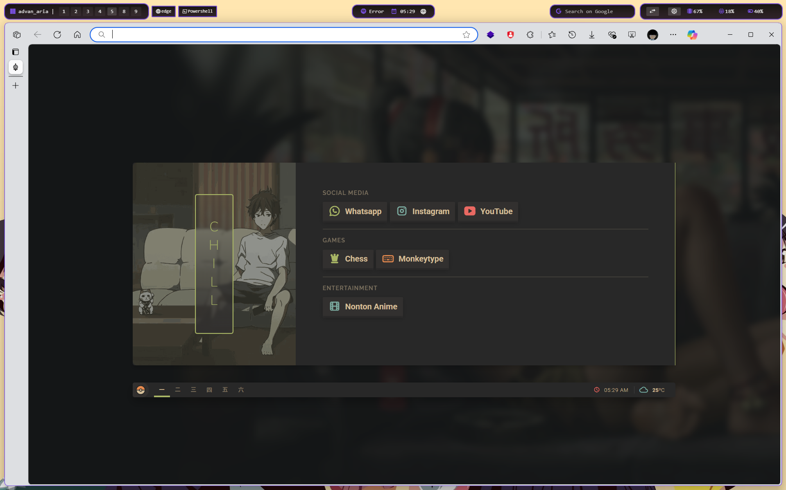
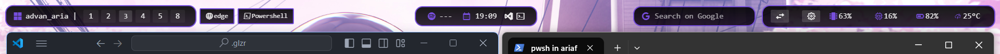
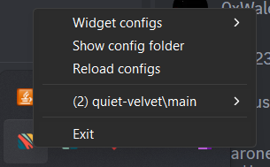

# My Dotfiles for Windows

[setup windows after install by ariaf](./setup/)

## Preview

[](https://youtu.be/R6P4njG09I0)

---

## Zebar

### Zebar Preview

- **Main View**  
  

- **Settings View**  
  

### How to Set Up Zebar

1. **Install Zebar & GlazeWM**

   Make sure you have installed [Zebar](https://github.com/zebar-dev/zebar) and [GlazeWM](https://github.com/glzr-io/glazewm).

2. **Clone the Repository**

```bash
git clone https://github.com/ariafatah0711/win_aria
cd win_aria/zebar
```

3. **Move Zebar Files**

```bash
mv quiet-velvet ~/.glzr/zebar/
cd ~/.glzr/zebar/quiet-velvet
```

4. **Set Up Configuration**

Create a `config.js` file inside the `quiet-velvet/src/` folder with the following content:

```javascript
export default {
  spotifyClientId: '<YOUR-SPOTIFY-CLIENT-ID>',
  spotifyClientSecret: '<YOUR-SPOTIFY-CLIENT-SECRET>',
  spotifyRefreshToken: '<YOUR-SPOTIFY-REFRESH-TOKEN>',
  explorerPath: '<YOUR-EXPLORER-PATH>',
  powershellPath: '<YOUR-POWERSHELL-PATH>'
}
```

> **Note:** Instructions for obtaining Spotify tokens are explained below.

5. **Build the Project**

```bash
npm install
npm run build
```

6. **Reload Zebar Configuration**

After building, reload Zebar to apply the changes.

7. **Done!**

You can now find the `quiet-velvet/main` widget configuration available!



---

## GlazeWM

### How to Set Up GlazeWM

1. **Install Zebar & GlazeWM**

   Ensure Zebar and GlazeWM are installed.

2. **Clone the Repository**

```bash
git clone https://github.com/ariafatah0711/win_aria
cd win_aria/glazewm
```

3. **Move GlazeWM Files**

```bash
mv glazewm ~/.glzr/glazewm/
```

---

## Terminal Settings

### How to Set Up Terminal

1. **Clone the Repository**

```bash
git clone https://github.com/ariafatah0711/win_aria
cd win_aria/terminal
```

2. **Apply Terminal Settings**

```bash
mv settings.json %APPDATA%\Code\User\settings.json
```

---

## Oh My Posh

### (Coming Soon)

> Full setup guide including themes and custom prompts will be added soon!

---

## Startpage

### How to Set Up Startpage

1. **Clone the Repository**

```bash
git clone https://github.com/ariafatah0711/home
cd home
```

2. **Load as Browser Extension**

- Open your browser's extension page:
  - Edge: `edge://extensions`
  - Chrome: `chrome://extensions`
- Enable Developer Mode.
- Click **Load unpacked**.
- Select the cloned `home` folder.

---

## Spotify Configuration Guide

### How to Get Your Spotify Tokens

1. Go to [Spotify Developer Dashboard](https://developer.spotify.com/dashboard).
2. Create a new application.
3. Set the Redirect URI to `http://localhost:8888/callback/`.
4. Note your **Client ID** and **Client Secret**.
5. Use a tool like [Spotify Token Generator](https://github.com/Binaryify/spotify-token) or manually authorize your app to get a **Refresh Token**.

> These credentials are needed inside `config.js` to enable Spotify integration!

---

> Built with passion by **Aria Fatah**. Happy customizing! 🚀

