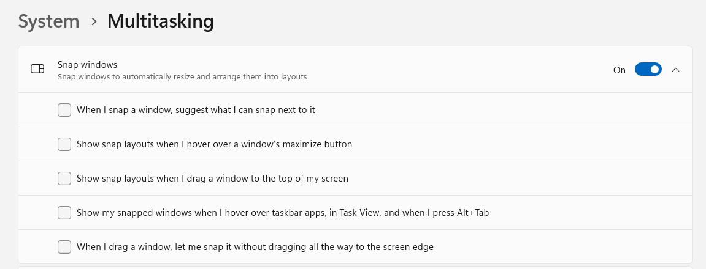
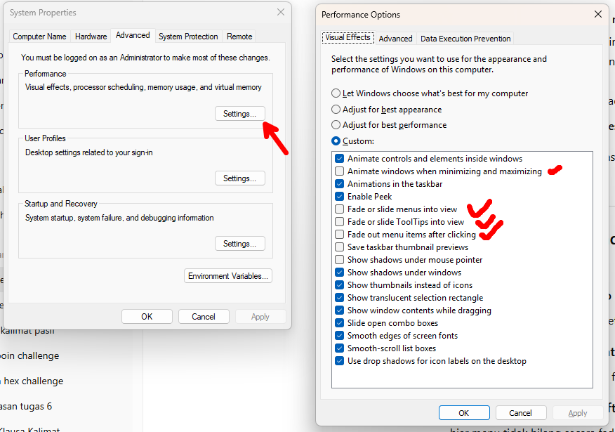

# **A. Required (Wajib)**
## **1. Driver**
* 📺 [Panduan YouTube](https://youtu.be/r7kOhoqBTiA?si=N5-C-tLFm3i5SSiO)
* 📦 [Download Driver (MediaFire)](https://www.mediafire.com/file/8qhm7xb6q4p9svh/Driver_Workplus.rar/file)

> **Cara penggunaan:**
>
> 1. Buka **Device Manager**.
> 2. Pilih perangkat yang ingin di-install drivernya.
> 3. Klik **Update driver**.
> 4. Pilih **Browse my computer for drivers**.
> 5. Arahkan path ke folder hasil ekstrak file RAR driver.

---

## **2. Setting**
### **Display**
- **System > Display > Scale**
  - Ubah menjadi **125%** atau **110%**.

### **Mouse Pointer & Touch**
- **Device > Mouse > Mouse Pointer and Touch**
  - Warna: **Kuning**
  - Ukuran: **3**
- custome pointer image
  - [sweezy-cursors](https://sweezy-cursors.com/)
  - [deviantart](https://www.deviantart.com/)
  - [windows 11 cursor concept v2](https://www.deviantart.com/jepricreations/art/Windows-11-Cursors-Concept-v2-886489356)
    
    

### **Taskbar**
- **Personalization > Taskbar**
  - **Taskbar items**:
    - Nonaktifkan **Task View** dan **Widgets**
    - **Search**: ubah menjadi **Search icon only**
  - **Taskbar behavior**:
    - Aktifkan: **Automatically hide the taskbar**
    - Nonaktifkan: **Show badges**, **Show flashing app**
    - **show smaller taszkbar**, ubah jadi always

### **Multitasking**
- **System > Multitasking**
  - **snap windows**
    
    - disable all
  - **Show tabs from apps when snapping or pressing Alt + Tab**: pilih **Don't show tabs**

### **Visual Effect**
- **Accessbility > Visual Effect**
  - ** disable Animation **Effects**

### **Stop Animation**
- **Go to View Advance setting**
- **Performance Options > Visual Effect**
  - Animate controls and elements inside windows – animasi kecil di dalam aplikasi.
  - Animate windows when minimizing and maximizing – animasi buka/minimize/maximize window.
  - Animations in the taskbar – animasi taskbar saat pindah aplikasi/hover.
  - Fade or slide menus into view – animasi menu muncul pelan (fade/slide).
  - Fade or slide ToolTips into view – animasi tooltip muncul perlahan.
  - Fade out menu items after clicking – menu hilang pakai efek fade.
  - Slide open combo boxes – animasi dropdown terbuka dari atas ke bawah.
  - Show shadows under windows – bayangan halus di bawah jendela.
  - Show shadows under mouse pointer – bayangan kecil di bawah kursor.
  - Show translucent selection rectangle – kotak seleksi file yang transparan.
  - Show window contents while dragging – lihat isi jendela saat digerakkan.
  - Show thumbnails instead of icons – tampilkan preview gambar/video, bukan ikon.
  - Smooth edges of screen fonts – halusin tekstur font (anti-aliasing).
  - Smooth-scroll list boxes – scrolling daftar jadi halus, bukan patah-patah.
  - Use drop shadows for icon labels on the desktop – bayangan teks ikon desktop.
  - Save taskbar thumbnail previews – simpan preview kecil aplikasi di taskbar.
  - Enable Peek – fitur “peek desktop” saat hover pojok kanan (Aero Peek).

  
