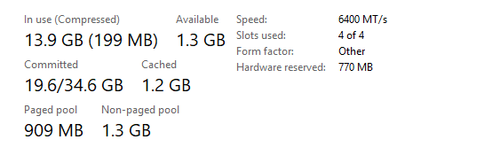
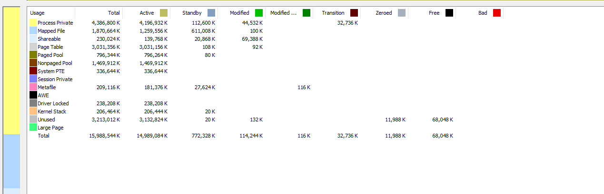
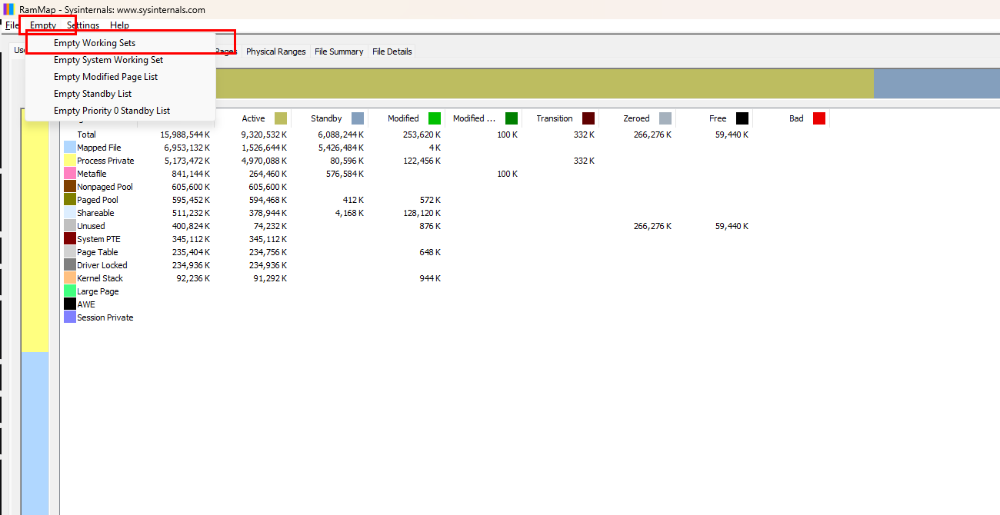
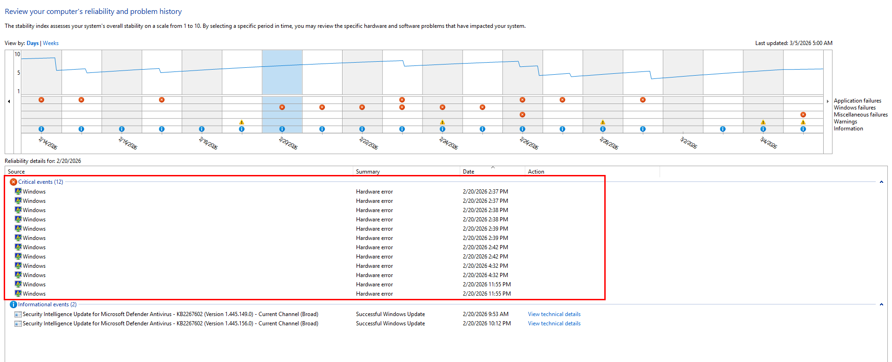

# Memory
## RAMMap
RAM tiba-tiba 80–90% padahal aplikasi yang dibuka sedikit.

Contoh:
- Microsoft Edge ~1 GB
- Discord ~600 MB
- proses lain kecil

> Total RAM tetap hampir penuh (~14 GB dari 16 GB).

Gunakan tool **RAMMap** untuk melihat detail memory usage.
1. Download RAMMap dari [Microsoft Sysinternals](https://docs.microsoft.com/en-us/sysinternals/downloads/rammap).
2. Jalankan RAMMap sebagai administrator.
3. Di tab "Use Counts", perhatikan kategori "Active" dan "Standby".
- **Active**: Memory yang sedang digunakan oleh aplikasi.
- **Standby**: Memory yang tidak aktif tapi masih disimpan untuk kemungkinan digunakan kembali.

4. Temuan di RAMMap:
- Page Table sempat ~3 GB
- Working Set besar
- Setelah dibersihkan RAM langsung turun

5. gunakan fitur "Empty → Empty Working Sets", atau "Empty → Empty System Working Set" di RAMMap untuk membersihkan Standby memory.

6. matikan hardware acceleration di aplikasi yang mendukung (misalnya Microsoft Edge) untuk mengurangi penggunaan RAM. atau discord juga bisa dimatikan hardware accelerationnya.
- Microsoft Edge: Settings → System → Hardware acceleration → Off
- Discord: User Settings → Advanced → Hardware Acceleration → Off

## Reliability Monitor
Jika RAM tiba-tiba penuh, bisa jadi ada aplikasi atau driver yang mengalami crash atau error yang menyebabkan memory leak.
1. Buka Reliability Monitor:
- Tekan `Win + R`, ketik `perfmon /rel`, lalu tekan Enter.
2. Periksa timeline untuk melihat apakah ada aplikasi atau driver yang mengalami crash atau error.
- Jika ada, klik pada event tersebut untuk melihat detailnya.
- Cari aplikasi atau driver yang sering mengalami masalah, karena ini bisa menjadi penyebab memory leak.
3. Jika menemukan aplikasi atau driver yang bermasalah, coba update atau reinstall aplikasi tersebut.
- Update aplikasi melalui Microsoft Store atau situs resmi.

