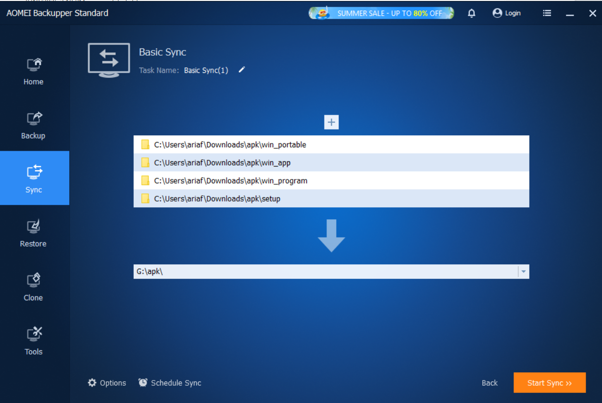

# B. Install App
## 1. app wajib
- [hdd_sentinel](https://www.hdsentinel.com/download.php)
  pilih yang standar => ini berfungsi untuk melihat kesehatan hdd
- [cystal_disk_info](https://crystalmark.info/en/)
  CrystalDiskInfo (untuk health monitoring) => ( pilih yang shizuku / bebas )
- [crystal_disk_mark](https://crystalmark.info/en/software/crystaldiskmark/) / [link_2](https://crystalmark.info/en/download/#CrystalDiskMark)
  CrystalDiskMark (untuk speed test)
- [raidrive](https://www.raidrive.com/download)
  berfungsi untuk install menghubungkan ke nas / storage cloud
- [aomeibackup](https://www.aomeitech.com/ab/)
  berfungsi untuk backup data
   [2](https://www.diskpart.com/download.html)
- [aomeipartision](https://www.aomeitech.com/pa/)
  berfungsi untuk partisi advance

## 2. application installer
## microsft store
- Vs Code
- Spotify, Sound Cloud
- WhatsApp, Unigram
- Obs Studio
- capcut
- powertoys

### learning
- [cisco_packet tracert](https://www.netacad.com/resources/lab-downloads) **wajib login**
- [steam](https://store.steampowered.com/) **untuk game**

## 3. application portable
- [winbox mikrotik](https://mikrotik.com/download) **terdapat 2 versi. versi 3 dan 4**

## 4. application with scoop
### a. intall scoop
```bash
Set-ExecutionPolicy -ExecutionPolicy RemoteSigned -Scope CurrentUser
Invoke-RestMethod -Uri https://get.scoop.sh | Invoke-Expression

scoop bucket <option>
scoop install <package>
scoop uninstall <package>
scoop info <package>

# code (scoop which crystaldiskinfo) # jika ingin lihat manifestnya
```

### b. install app with scoop
```bash
scoop bucket add extras

scoop install git speedtest-cli openssh
scoop install fastfetch adb scrcpy
scoop install obsidian cursor
scoop install nodejs
scoop install nodejs-lts

# more tools
scoop install grep # buat grep bisa pake | juga
## example: ps | grep edge

# depretec (gak bisa dipake lagi)
# scoop install nmap
```

## 5. application with scoop
### 1. office
- [https://www.microsoft.com/en-us/download/details.aspx?id=49117](https://www.microsoft.com/en-us/download/details.aspx?id=49117)
- [https://config.office.com/](https://config.office.com/)
- [https://config.office.com/deploymentsettings](https://config.office.com/deploymentsettings)
  - english
  - word, powerpoint, excel

- buat folder misal di ```D:/msoffice````
- lalu ketika run office deployment pilih folder itu
- jika sudah jalankan perintah ini
  ```bash
  ./setup.exe /download ./Configuration.xml
  ./setup.exe /configure ./Configuration.xml
  ```

## 6. python library wajib
```bash
```
