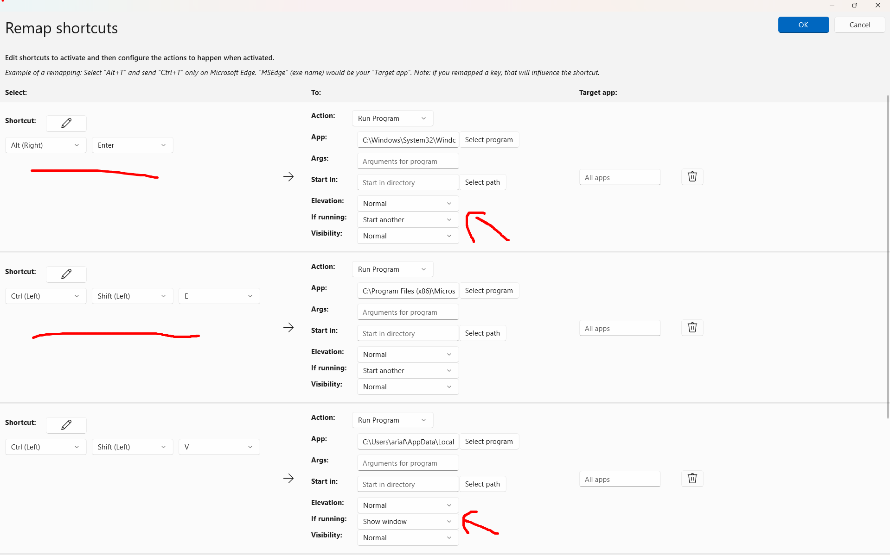
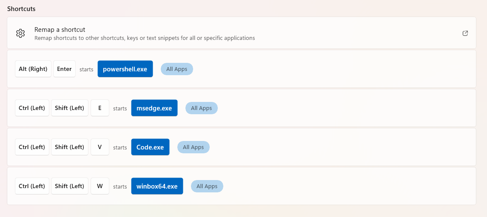
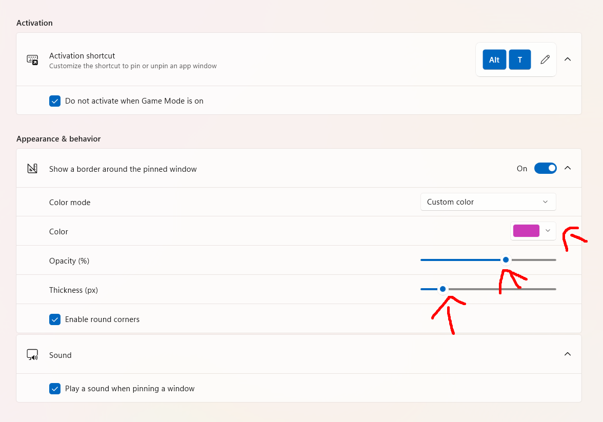

# Tools
## 1. powertoys
### zoom
- 1 => 2 (zoom only)
- 2 => 1 (draw)
- 3 => 4
- 4 => 3 (zoom with mouse)

### keyboard manager
#### Remap A Shorcuts
example:
- 
- 

1. Alt + Enter
   - C:\Windows\System32\WindowsPowerShell\v1.0\powershell.exe - start another
   - start in: E:
3. Alt + Q
   - ALt + F4
4. Alt + E
   - C:\Program Files (x86)\Microsoft\Edge\Application\msedge.exe - start another
5. Alt + V
   - C:\Users\ariaf\AppData\Local\Programs\Microsoft VS Code\Code.exe - show windows
6. Alt + W
   - C:\Users\ariaf\Downloads\apk\win_portable\winbox64.exe - show windows
7. Alt + A
   - Ctrl + Win + Left
8. Alt + S  
   - Ctrl + Win + Right
9. Alt + F
   - F11

### Always On Top
- rename shorcut: **Alt + T** 
  

### Workspaces
- rename shorcut: **Ctrl + Shift + Enter**
