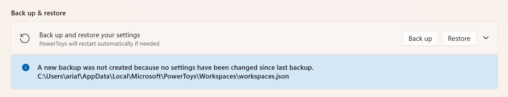

# Tools
## 1. powertoys
### zoom
- 1 => 2 (zoom only)
- 2 => 1 (draw)
  - Warna
    - R → merah
    - G → hijau
    - B → biru
    - Y → kuning
    - O → oranye
    - P → pink
  - shape
    - Shift + drag → garis lurus.
    - Ctrl + drag → persegi panjang.
    - Tab + drag → elips.
    - Shift + Ctrl + drag → panah.
  - shorcut
    - Ubah ketebalan pena: tekan Ctrl + gulir roda mouse atau tekan panah atas/bawah.
    - Masuk / keluar mode gambar (saat sudah zoom): klik kiri.
    - Keluar mode gambar: klik kanan.
    - Undo (batalkan gambar terakhir): Ctrl + Z.
    - Hapus semua gambar: tekan E.
    - Pusatkan kursor: Spasi.
  - Layar
    - W → layar putih (seperti papan tulis).
    - K → layar hitam.
    - Ctrl + C → copy layar yang sedang dizoom.
    - Ctrl + S → simpan layar yang sedang dizoom.
    - Ctrl + Shift + C / S → crop lalu copy / save.
  - Highlight & Blur
    - Shift + (tombol warna) → warna jadi stabilo transparan.
    - X → blur.
    - Shift + X → blur lebih kuat.
- 3 => 4
- 4 => 3 (zoom with mouse)
  - Ctrl + Up => zoom in
  - Ctrl + Down => zoom out

### keyboard manager
- [shorcut_windows_full](https://tekno.kompas.com/read/2021/07/06/20200087/daftar-tombol-shortcut-di-windows-10-lengkap)

#### Remap A Shorcuts
example:
- 
- 

> jangan lupa pake exact match di semua shorcut

- Alt + Enter => buka terminal
  - C:\Windows\System32\WindowsPowerShell\v1.0\powershell.exe - start another
  - start in: E:
- Alt + Shift + Q => menutup aplikasi
  - ALt + F4
- Alt + Ctrl + F => buka file explor
  - Win + E (open file explorer)
- Alt + Ctrl + E => buka edge
  - C:\Program Files (x86)\Microsoft\Edge\Application\msedge.exe - start another
- Alt + Ctrl + V => buka vs code
  - C:\Users\ariaf\AppData\Local\Programs\Microsoft VS Code\Code.exe - show windows
- Alt + Ctrl + W => buka winbox
  - C:\Users\ariaf\Downloads\apk\win_portable\winbox64.exe - show windows
- Alt + F => fullscreen
  - F11
- Alt + A => pindah desktop ke kiri
  - Ctrl + Win + Left
- Alt + S => pindah desktop ke kanan
  - Ctrl + Win + Right
- Alt + D => minimize semua jendela
  - Win + D (Minimize semua jendela)

> bawahnya opsional soalnya yang atas udh oke sih itu

- Alt + Ctrl + ` => membuat desktop virtual
  - Win + Ctrl + D (membuat desktop virtual)
- Alt + ctrl + 1 => menutup desktop virtual
  - Win + Ctrl + F4 (menutup desktop virtual yang sedang aktif)
- Alt + Shift + H => memindahkan aplikasi ke kiri
  - Win + Alt + Left
- Alt + Shift + L =>
  - Win + Alt + Right
- Alt + Shift + J =>
  - Win + Alt + Top
- Alt + Shift + K =>
  - Win + Alt + Bottom

> terkadang ketika menggunakan ini bisa menyebabkan bug di windows 11
- contoh: windows 11 tb tb keyboardnya gak bisa di click WIN, dan tampilan click kanan pada desktop jadi gini
  
- solusinya coba lakukan WIN + Shift + S
  - untuk shorcut yang dimana itu bisa mempebaiki, dan jika udh berhasil coba click WIN apakah sudah berhasil jika sudah lakukan restart / shutdown
  - karena bug ini kadang bikin bug di banyak hal.

> kalo bsia jangan sampe restart sebelum di click WIN berhasil soalnya pas gw coba kadang bugnya bikin malah masuk ke recovery mode, dan kalo di shutdown dia biasanya malah unsafe shutdown ke detect

### Always On Top
- rename shorcut: **Alt + T**
  

### Workspaces
- rename shorcut: **Ctrl + Shift + Enter**

#### text extractor
- enable text extractor: **WIN + SHIFT + T**

### backup
#### manual backup
- Navigate to **%LOCALAPPDATA%\Microsoft\PowerToys\**
- Copy the file settings.json to a safe location (like an external drive or cloud storage).

#### restore
- Replace the new settings.json with your backup copy in **%LOCALAPPDATA%\Microsoft\PowerToys\.**
- Restart PowerToys to load the saved settings.

#### automatic backup
- powertoys > general
- backup
  

#### automatic restore
- powertoys > general
- restore (pastikan file nya sudah ada)
  

## 2. visualize your keystrokes and mouse
### Keyviz
- [Keyviz](https://mularahul.github.io/keyviz/)

#### setup
```bash
scoop install keyviz
```

### NohBoard
- [NohBoard](https://github.com/ThoNohT/NohBoard)

## 3. AHK
### setup
- [AutoHotkey](https://www.autohotkey.com/)
- [VirtualDesktopAccessor](https://github.com/Ciantic/VirtualDesktopAccessor)

```bash
scoop bucket add extras
scoop install autohotkey
```

### startup
```bash
- C:\Users\<NAMAMU>\AppData\Roaming\Microsoft\Windows\Start Menu\Programs\Startup
- shell:startup

- buat shorcut ke file ahk mu di folder ini
```
