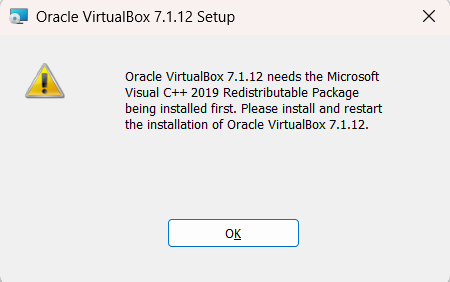

# C. Opsional
## 1. vbox
- [virtual box](https://www.virtualbox.org/wiki/Downloads)
- [c++](https://learn.microsoft.com/en-us/cpp/windows/latest-supported-vc-redist?view=msvc-170)

> jika ada error
### 1. need Microsoft Visual C++ 2019


lakukan install ini [c++](https://learn.microsoft.com/en-us/cpp/windows/latest-supported-vc-redist?view=msvc-170)

setelah itu jangan lupa add env variable untuk vboxmanage cli

1. Tekan Win + S → ketik environment variables → pilih Edit the system environment variables.
2. Klik Environment Variables...
3. Di bagian System variables, pilih Path → Edit.
4. Klik New, masukkan: ```C:\Program Files\Oracle\VirtualBox```
5. Tutup PowerShell, buka lagi, lalu coba:
6. test di terminal ```vboxmanage --version```

## vagrant
```bash
scoop install vagrant
vagrant --version
```

> jangan lupa ubah path default vm ya biar enak

1. Buka VirtualBox → File → Preferences → tab General → Default Machine Folder
2. Ganti ke folder tujuan, misalnya D:\VMs
3. Semua VM baru akan disimpan di sana.