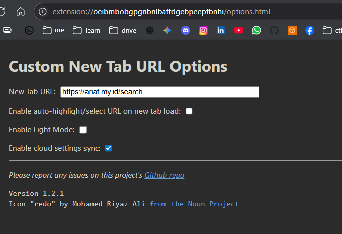

# list theme
## theme 1 (bonjour)
- [https://microsoftedge.microsoft.com/addons/detail/bonjourr-%C2%B7-beranda-minima/dehmmlejmefjphdeoagelkpaoolicmid](https://microsoftedge.microsoft.com/addons/detail/bonjourr-%C2%B7-beranda-minima/dehmmlejmefjphdeoagelkpaoolicmid)

## theme 2
- [https://github.com/ariafatah0711/home](https://github.com/ariafatah0711/home)

## theme 3
- [https://github.com/ariafatah0711/search](https://github.com/ariafatah0711/search)

# setup
## with extension
- Open your browser's extension page:
  - Edge: `edge://extensions`
  - Chrome: `chrome://extensions`
- Enable Developer Mode.
- Click **Load unpacked**.
- Select the cloned `home` folder.

## with extension custom new tab url
- [https://microsoftedge.microsoft.com/addons/detail/custom-new-tab-url/oeibmbobgpgnbnlbaffdgebpeepfbnhi](https://microsoftedge.microsoft.com/addons/detail/custom-new-tab-url/oeibmbobgpgnbnlbaffdgebpeepfbnhi)
- buka extension options
  
  - lalu masukan url web search yang sudah di deploy di github: https://ariaf.my.id/search/
